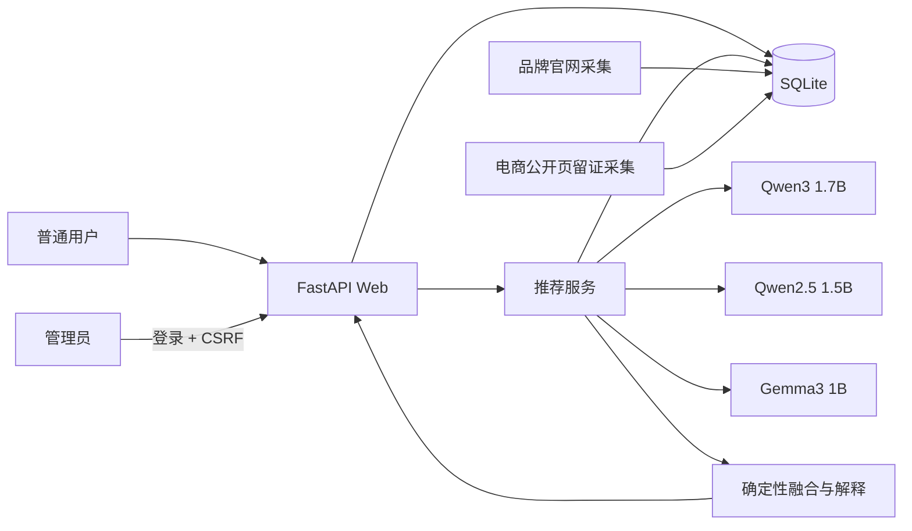

# 系统设计说明

## 1. 目标与边界

“择机”面向中国大陆手机购买场景，只推荐最近两年发布且仍在售的机型。系统保存每个内存版本的官方发售价，以及京东、天猫、拼多多已核验官方旗舰店的公开售价。每个平台展示一个无需额外资格的公开价格。

系统不代替电商结算页，不破解登录、验证码或反爬机制，也不会用推算值伪装成网页展示价格。

## 2. 架构

采用“数据库先筛选、模型再判断、算法最终融合”的结构。大模型不能直接决定价格或捏造候选机型，只能在数据库提供的候选集合中评分。即使某个模型超时或 JSON 解析失败，其余模型与确定性基线仍能给出结果。

## 3. 推荐流程

1. 从用户自然语言中读取预算与拍照、游戏、续航等偏好。
2. SQL 查询仍在售、活跃且存在有效内存版本的机型，并为每个平台取最新价格快照。
3. 以预算、参数和价格生成确定性基础分，缩小候选集。
4. 领域规则从全部合格版本中精排出 5 款不同机型，再将同一份紧凑候选数据并行交给三个轻量本地模型，要求返回受约束 JSON 分数。
5. 校验型号必须属于候选集，拒绝无法解析或越界的模型输出。
6. 以五维权重计算最终分，生成投票、数据来源、条件价格和不确定性说明。
7. 最终只返回 3 款不同机型，并为每款使用数据库事实生成自然语言解释；用户问题、模型原文、延迟、吞吐量、解析状态和最终答案全部写入数据库。

最终分：

`0.35 × 需求匹配 + 0.25 × 模型共识 + 0.20 × 数据可信度 + 0.15 × 性价比 + 0.05 × 数据时效性`

其中“模型共识”取三个模型对候选的投票与评分，“数据可信度”由官网来源、旗舰店核验和价格证据完整度决定。权重集中定义在推荐服务中，便于消融实验。

## 4. 可解释性

每条推荐同时展示：最终得分、入选原因、三个模型的投票数、满足的用户条件、基础参数、各平台普通价、资格价格提示、数据更新时间和来源链接。管理员后台还保留模型原始输出和成功状态，使结论可追溯、可复核。

## 5. 安全设计

- 管理接口在服务端逐请求鉴权，不能依靠隐藏按钮保护；
- Argon2id 保存密码哈希，Session Cookie 为 HttpOnly、SameSite=Lax；
- 所有状态修改请求验证 CSRF token；
- 登录失败按 IP 与用户名限流；
- “删除”采用停用/下架的软删除方式，避免误删历史价格与推荐证据；
- 新增、修改、停用和登录操作写入审计日志；
- SQLite 开启外键、WAL 和必要索引。

## 6. 部署特点

本项目定位单机课堂演示：FastAPI、SQLite 与 Ollama 均在本机运行，隐私好且不需要云 API 费用。若未来多用户并发，可将 SQLite 换成 PostgreSQL，把模型调用放到任务队列并启用反向代理 HTTPS。
