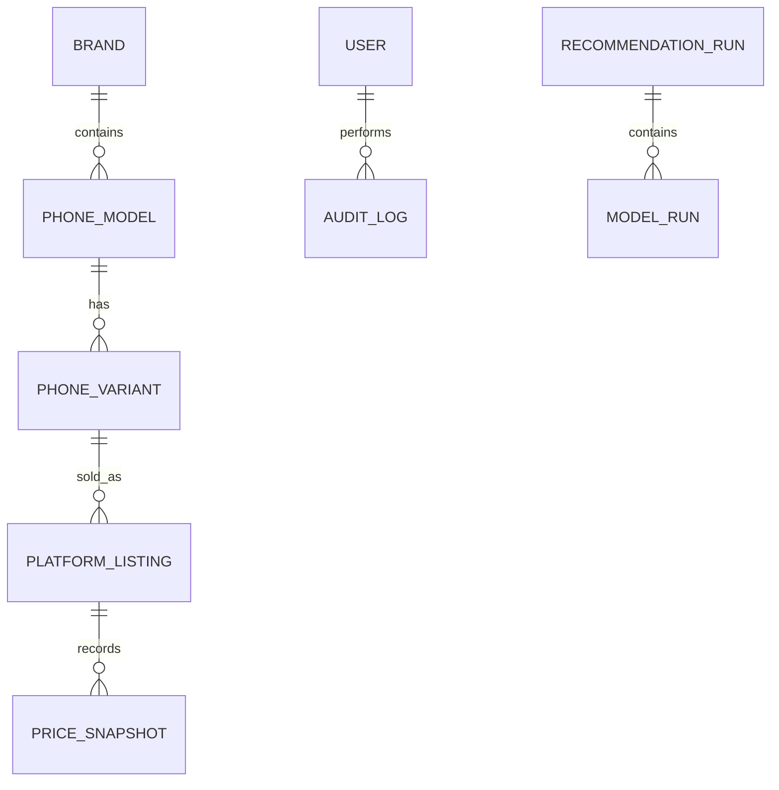

# 数据库设计与数据字典

## 1. 实体关系

核心设计是将“机型”和“内存版本”拆开。参数属于机型，发售价和电商 SKU 属于内存版本；价格使用快照表追加保存，不覆盖历史值。

## 2. 核心表

| 表 | 作用 | 关键约束 |
|---|---|---|
| `brands` | 品牌与官网 | 品牌名唯一 |
| `phone_models` | 型号、硬件参数和结构化特征 | 同一品牌型号唯一；发布日期/销售状态联合索引；NFC、5G、长焦、屏幕形态、无线充/防水支持为可空三态 |
| `phone_variants` | RAM、存储与发售价 | 型号 + RAM + 存储唯一 |
| `platform_listings` | 平台、官方店铺和商品链接 | 平台 + 商品ID + SKU文字唯一 |
| `price_snapshots` | 官方店公开价格历史 | 商品与采集时间索引；价格允许为空但不能猜测 |
| `users` | 管理员身份 | 用户名唯一；密码只存哈希 |
| `audit_logs` | 数据变更追踪 | 保存动作、表、记录和新旧值 |
| `recommendation_runs` | 每次推荐输入与最终输出 | 保存候选量、总耗时和异常 |
| `model_runs` | 单模型性能与原始回答 | 模型名/时间索引，保存 JSON 成功状态 |
| `crawl_logs` | 爬虫批次统计 | 保存成功、失败及错误原因 |

## 3. 价格字段语义

- `regular_price`：官方旗舰店当前页面普通售价；
- `public_sale_price`：所有用户公开可见、无需资格的活动最低价；
- `evidence_text_path` / `screenshot_path`：采集证据路径。

推荐预算比较优先使用无需资格的公开活动价，缺少活动价时使用常规价。旧数据库的历史优惠列保留为兼容字段，现行采集、导出和推荐均不再读取或写入。

价格可信级别由 `platform_listings.store_verified` 与 `price_snapshots.crawl_status` 共同决定：`reviewed` 且店铺已审核、带证据为最高级；`manual*` 为手工参考价；其余仅作为待复核信息。推荐优先采用最高可信级别，手工价会降低数据可信分并在页面与理由中明确标注。

`phone_models.image_url` 保存产品图地址，`image_source_url` 保存能够证明图片归属的来源页面。图片优先来自品牌官网，第三方回退来源会明确标注；页面不生成或拼接虚假手机图，图片缺失或加载失败时明确显示缺失状态。

## 4. 增删改查策略

后台支持品牌、型号全部关键参数、版本、商品链接和价格快照的新增与查询；型号、状态等可修改；删除采用 `is_active=false` 或 `discontinued`。价格不修改旧快照，而是新增一条记录，从而可以解释“推荐当时为什么是这个价格”。

批量数据通过 `scripts/import_catalog.py` 事务导入：任一行失败则整批回滚；`--dry-run` 可先做格式验证；重复记录按唯一键跳过。`scripts/export_data.py` 输出 UTF-8 BOM CSV 并复制 SQLite 备份，便于 Excel 打开和故障恢复。

人工采集表格更新时，先运行 `python scripts/generate_price_queue.py`，再运行 `python scripts/export_data.py --output work/data-export-public-prices`，最后使用项目配置的 Node.js 运行 `scripts/build_manual_collection_workbook.mjs`。新版表格只含发售价、常规价和公开活动价；旧表格留作历史资料。
